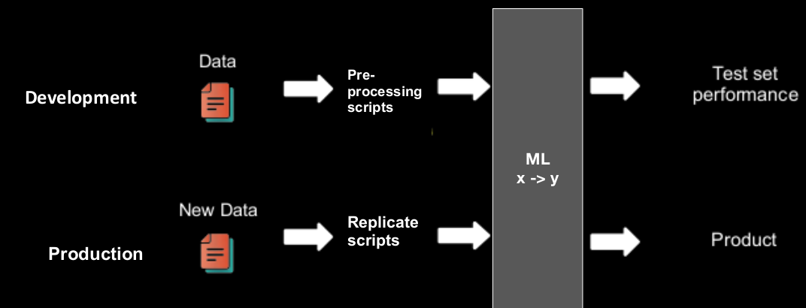

<div dir="rtl" text-align="justify">

دیپولیمنت و پایپلاین
===================

در این گزارش قصد داریم تا مراحل دیپلویمنت و همچنین پایپلاین کردن را بررسی کنیم.

در گزارش ژوپیتر، ذکر شده که از نظر منطق ML چگونه کد کار می‌کند. به کد پایتون آن تکه بخش‌هایی اضافه می‌شوند تا بتوانیم این کدها را به صورت پایپلاین اجرا کنیم.

### ساختار پایپلاین

منطق این ساختار مشابه جزوه‌ی درس پیش رفته شده است:



البته چون نتایج ما به سمت کاربر برمی‌گردد، در حقیقت دو کانتینر گذاشتیم. یکی برای تمیزکاری داده‌ها و دیگری برای آزمون/آزمایش و پروداکشن.

### ساخت docker-compose

برای اجرای چند `container` بهترین کار استفاده از `docker-compose` است. به این منظور فایل `docker-compose.yml` ایجاد شده است. که در آن مشخص شده چه `image`هایی به کار می‌روند. همچنین جهت ارتباط بین `container`ها یک شبکه به اسم mlflow تعریف شده است.

### توضیح کد‌ها

#### Data

<div dir="ltr">

```python

@api.route('/analyze', methods=['POST'])
def analyze():
    phase = request.args.get('phase')
    if phase == 'dev':
        file_name = 'data.csv'
    elif phase == 'prod':
        file_name = 'query.csv'
    else:
        return "Not a valid phase"
    data_f = request.files.get('data_file')
    data_f.save(file_name)
    pre_process(file_name)
    res = send(phase)
    return res

```
</div>

این قسمت مسیری است که کاربر به آن فایل `csv` خود را ارسال می‌کند. بسته به اینکه در کدام فاز `dev` یا `prod` باشیم، تصمیم می‌گیریم که فایل مربوطه را به چه نامی ذخیره کنیم. البته فرآیند پیش‌پردازش تفاوتی نمی‌کند. 

<div dir="ltr">

```python

def send(phase: str):
    host = 'mlflow'
    port = 8080
    url = f'http://{host}:{port}/ml?phase={phase}'
    csv_f = open(MODIFIED_CSV, 'rb')
    r = requests.post(url=url, files={'data_file': csv_f})
    return r.text

```

</div>

تابع `send` داده‌های تمیز‌شده را به `container` مربوط به `mlflow` ارسال می‌کند. البته چون کلا با یک پورت می‌توانیم ارتباط داشته باشیم، نمی‌توان در اینجا روی `dev` یا `prod` بودن تصمیم گرفت. بنابر این تکه کد زیر زده می‌شود.

#### XGBModel

<div dir="ltr">

```python

@api.route('/ml', methods=['POST'])
def ml():
    phase = request.args.get('phase')
    if phase in ('dev', 'prod'):
        file_name = MODIFIED_CSV
    else:
        return "Not a valid phase"
    data_f = request.files.get('data_file')
    data_f.save(file_name)
    if phase == 'dev':
        ret_val = model()
    else:
        ret_val = send_to_mlflow()
    return ret_val

```

</div>

این `route` داده‌های تمیز را از `preprocess` می‌گیرد. اگر در فاز `dev` باشیم آنگاه با صدا زدن تابع `ml` همان فرآیند یادگیری و بررسی دقت و `F-score` ادامه می‌دهد. اگر در فاز `prod` باشیم، آنگاه آن را به `mlflow` که بر روی یک پورت داخلی در حال اجرا است می‌فرستد.

<div dir="ltr">

```python

def send_to_mlflow():
    host = '127.0.0.1'
    url = f'http://{host}:{MLFLOW_PORT}/invocations'
    headers = {
        'Content-Type': 'application/json',
    }
    test_data = pd.read_csv(MODIFIED_CSV, sep='\t')
    http_data = test_data.to_json(orient='split')
    r = requests.post(url=url, headers=headers, data=http_data)
    return f'Predictions: {r.text}'

```
در این قسمت یک اتصال `REST` به `mlflow` برقرا می‌شود و فایل تمیز شده جهت فاز `production` ارسال می‌شود.

</div>

<div dir="ltr">

```python

def kill_mlflow():
    os.system('pkill mlflow')
    os.system(f'fuser -k {MLFLOW_PORT}/tcp')

```

</div>

با توجه به اینکه ممکن است باز هم فاز `dev` داشته باشیم، پس اگر نسخه‌ی پیشین بالا باشد با کمک این تابع آن را پایین آورده، پورت را آزاد می‌کنیم و دوباره با مدل جدید `mlflow` اجرا می‌شود.


#### request

<div dir="ltr">

```python

import requests
import sys

host = '127.0.0.1'

port = 8050

file_name, phase = str(sys.argv[1]), str(sys.argv[2])
url = f'http://{host}:{port}/analyze?phase={phase}'
csv_f = open(file_name, 'rb')
r = requests.post(url=url, files={'data_file': csv_f})
print(r.text)

```

</div>

در ایین قسمت با دو آرگومان فایل و `phase` که می‌تواند `dev` یا `prod` باشد فایلی به `Data.py` که فاز پیش‌پرداز است فرستاده می‌شود.

### پیش‌نیازهای اجرا

حتما پیش از اجرا اطمینان حاصل کنید که `docker` و `docker-compose` نصب هستند.

### نحوه‌ی اجرا

برای اجرا کافی است `start.sh` را اجرا کنید. در آن ابتدا با توجه به داکرفایل‌ها `image`های مربوطه ساخته می‌شوند و سپس با `docker-compose` بالا می‌آیند.
برای متوقف ساختن هم `stop.sh` را بزنید.

```bash

python3 request.py ../train_dataset.csv dev
python3 request.py query_dataset.csv prod
```
با اجرای دستورات بالا، ابتدا فرآیند `dev` و سپس `prod` انجام می‌شود.

</div>
